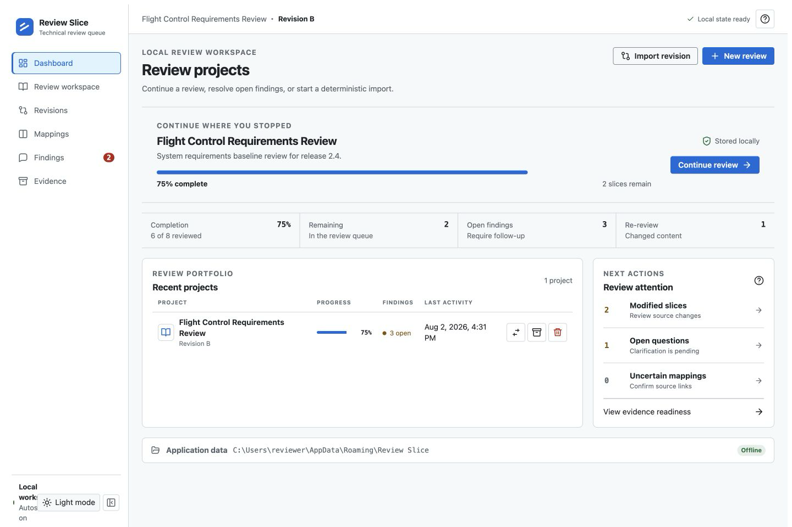
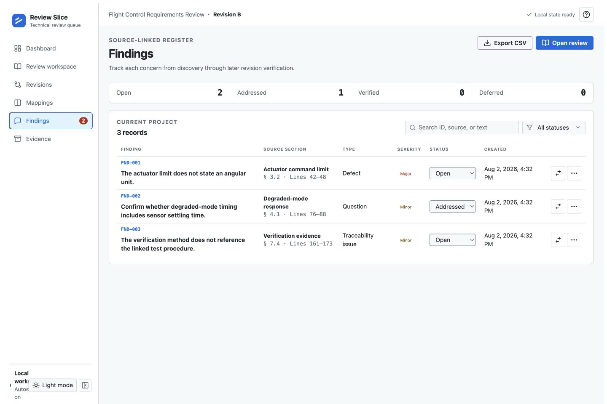
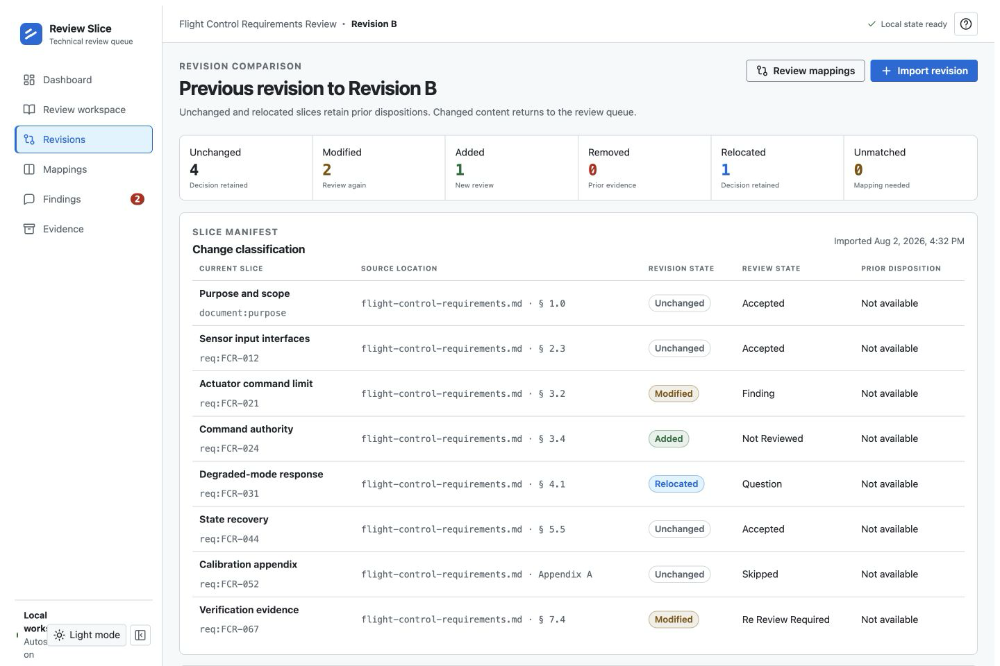

# Review Slice

Review Slice is a local-first desktop application for structured, source-linked technical reviews. It turns supported documents and source directories into stable review slices, preserves review decisions across revisions, tracks findings against exact source locations, and exports a review evidence package.



## What the application supports

- Import Markdown, text, Word DOCX, text-based PDF, CSV, JSON, XML, diff, and patch files, or import a source-code directory. DOCX import preserves reviewable headings, lists, tables, and paragraphs; image-only documents require OCR before import.
- Review each source slice as accepted, skipped, questioned, or linked to a finding.
- Re-import a revision and classify slices as unchanged, modified, added, removed, relocated, or unmatched.
- Retain prior dispositions only for unchanged or equivalently relocated content.
- Manage source-linked findings through open, addressed, verified, rejected, and deferred states.
- Export review summaries, finding registers, source manifests, review history, and a complete evidence ZIP.
- Keep review content and state on the local computer; the installed application does not require network access.

## Product tour

### Source-linked review workspace

The review workspace keeps the review queue, immutable source content, current disposition, linked findings, and keyboard actions in one workbench.


### Findings register

Every finding retains its source slice and exact location. Reviewers can filter the register, update lifecycle state, add resolution notes, return to the linked source, or export CSV.



### Revision comparison

The revision view summarizes change classifications and identifies the content that must return to the review queue. Unchanged and equivalently relocated slices retain their previous decisions.



## Run locally

Install dependencies and start the Vite renderer with Electron.

```bash
npm ci
npm run dev
```

Production starts with an empty local workspace. Import an artifact to create the first review project.

## Verify the source

Run type checking, module tests, and production builds together.

```bash
npm run verify
```

The individual commands are `npm run typecheck`, `npm test`, and `npm run build`.

## Build the Windows package

Create the portable Windows x64 ZIP.

```bash
npm run dist:win
```

The build writes `release/Review-Slice-1.0.0-x64.zip`.

To deploy it on Windows 11:

1. Copy the ZIP to the target computer.
2. Extract it to a local directory.
3. Keep all extracted files together.
4. Run `Review Slice.exe`.

## Local state and evidence

Review projects, findings, and recovery state remain in Electron's local user-data storage. The application maintains primary and backup records and shows the local application-data location in the interface. Export actions write selected evidence files through a local save dialog.

Create a new Assured run for each release. Release approval should use the completion record, timeline, verification results, and governed view captures from that run, matched to the exact source revision and package hash.

The images in [`docs/evidence`](docs/evidence) are current product screenshots captured from the deterministic demonstration workspace. They document the interface; they are not governed release evidence.
