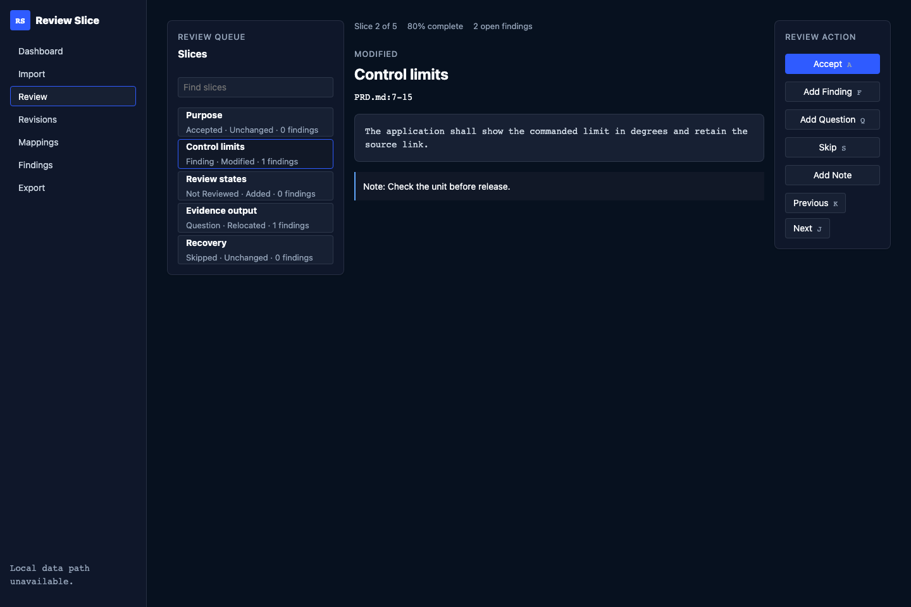

# Review Slice

Review Slice is a local desktop application for source-linked technical reviews.
The application stores review state in the Electron user data directory.
The application writes a primary JSON file and a recoverable backup.

## Assured evidence

The final capture shows the review workspace at 1440 x 960.
The capture record reports completed views.



Read the [Assured evidence ledger](docs/evidence/assured-mode-evidence.md).

## Run application

Install dependencies in the overlay directory.

```bash
npm install --package-lock=false
npm run dev
```

## Verify application

Run the required local checks.

```bash
npm run typecheck
npm test
npm run build
```

## Package installer

Create a Windows x64 NSIS installer.

```bash
npm run dist:win
```

## Data path

The dashboard and review workspace show the local data path.
The export action creates an evidence ZIP through a local save dialog.
